# SYColorConverter
## YUV
### 简述
**YUV：**是一种颜色空间，基于 `YUV` 的颜色编码是流媒体的常用编码方式，这种表达方式起初是为了彩色电视与黑白电视之间的信号兼容；其中

- *Y：*表示明亮度（Luminance 或 Luma），也称灰度图。
- *U、V：*表示色度（Chrominance 或 Chroma），作用是描述影像的色彩及饱和度，用于指定像素的颜色。

**Y’CbCr：**（也称为 YUV），是 `YUV` 的压缩版本，不同之处在于 `Y’CbCr` 用于 **数字图像** 领域，`YUV` 用于 **模拟信号** 领域；`MPEG`、`DVD`、摄像机中常说的 `YUV` 其实是 `Y'CbCr`，二者转换为 `RGBA` 的转换矩阵是不同的。

- *Cr：*（色度红）反应了 `RGB` 输入信号 红色 部分与 `RGB` 信号亮度值之间的差异（即，当前颜色对 **红色** 的偏移程度）。
- *Cb：*（色度红）反应了 `RGB` 输入信号 蓝色 部分与 `RGB` 信号亮度值之间的差异（即，当前颜色对 **蓝色** 的偏移程度）。

	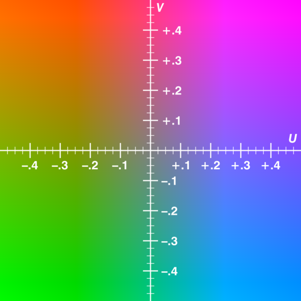

> **注意：**如无特殊说明，本文讨论的 `YUV` 均指 `Y'CbCr` 。


### 格式
#### YUV存储格式：
- **planar：**先存储 `Y`，然后 `U`，然后 `V`。
- **packed：**`yuv` 交叉存储。

#### 常见格式
1. **yuv444：** packet 采样（`yuv yuv yuv`）和 planar 采样（`yyyy uuuu vvvv`）
2. **yuv422：**packet 采样
	- **yuvy：**`YUYV YUYV`
	- **uyvy：**`UYVY UYVY`
3. **yuv422p：**planar采样：`YYYY UU VV`
4. **yuv420：**packet采样： `YUV Y YUV Y`
5. **yuv420p：**planar采样
    - **I420：**
		
		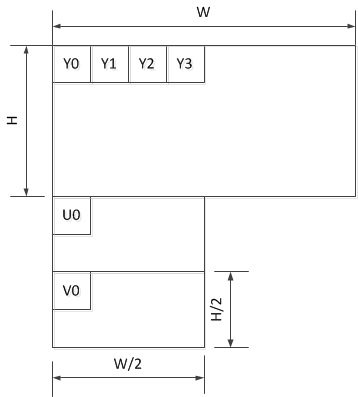
    - **YV12：**

    	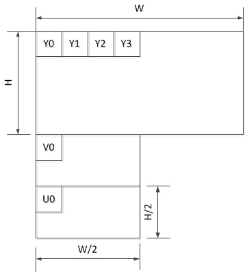
6. **yuv420sp：**`Y` 是planar采样，`UV` 是packet采样
	- **NV12：**

		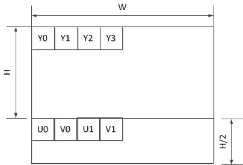
	- **NV21：**

		


## RGB
### 简介
**RGB：**是一种加色模型，将红（`Red`）、绿（`Green`）、蓝（`Blue`）三原色的色光以不同的比例相加，以产生多种多样的色光；且三原色的红绿蓝不可能用其他单色光合成。

1. **浮点表示方式：**取值范围为 `0.0 ~ 1.0`（如在 **OpenGL** 中对每个子像素点的表示就是使用这个表示方式）。
2. **整数表示：**取值范围为 `0 ~ 255` 或者 `00 ~ FF`（如 **RGBA_8888**、**RGB_565**）。

### 格式
#### 索引形式 
1. **RGB1：**每个像素用 1 个 `bit` 表示 `0`，`1` 两种值，可表示的颜色范围为双色，即最传统的黑和白；需要调色板，不过调色板只包含两种颜色。
2. **RGB4：**每个像素用 4 个 `bit` 表示，4 个 `bit` 所能够表示的索引范围是 `0~15`，共 16 个。也就是可以表示 16 种颜色。即调色板中包含 16 中颜色。
3. **RGB8：**每个像素用 8 个 `bit` 表示。8 个 `bit` 所能够表示的索引范围是 `0~255`，共 256 个。也就是可以表示 256 种颜色。即调色板中包含 256 种颜色。

#### 像素形式
1. **RGB555：**
	- **概述：**每一个像素用 16 个 `bit`（2个字节）来表示，**但最高位不用**，**R** 用 5 个 `bit`、**G** 用 5 个 `bit`、**B** 用 5 个 `bit` 表示。
	- **内存示意图：**
		
		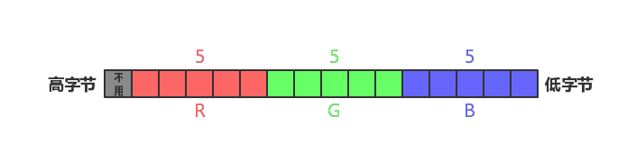
	- **获取具体像素值方法：**（假设 `color` 为存储某一个像素点的变量）

		- `R = color & 0x7C00`		// 获取高字节 5 个 bit
		- `G = color & 0x03E0`		// 获取中间的 5 个 bit
		- `B = color & 0x001F`		// 获取低字节 5 个 bit
2. **RGB565：**
	- **概述：**每一个像素用 16 个 `bit`（2 个字节）来表示，**R** 用 5 个 `bit`、**G** 用 6 个 `bit`、**B** 用 5 个 `bit` 表示。
	- **内存示意图：**
 		
 		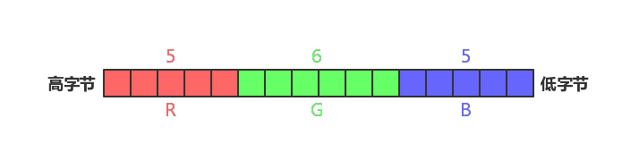
 	- **获取具体像素值方法：**（假设 `color` 为存储某一个像素点的变量）
		
		- `R = color & 0xF800`		// 获取高字节 5 个 bit
		- `G = color & 0x07E0`		// 获取中间的 6 个 bit
		- `B = color & 0x001F`		// 获取低字节 5 个 bit
3. **RGB24：**
	- **概述：**每一个像素用 24 个 `bit`（3个字节）来表示，**R**、**G**、**B** 均用 8 `bit` 表示。
	- **内存示意图：**

		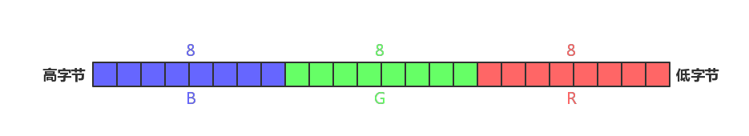
	- **获取具体像素值方法：**（假设 `color` 为存储某一个像素点的变量）

		- `R = color & 0x0000FF`
		- `G = color & 0x00FF00`
		- `B = color & 0xFF0000`
4. **RGB32：**
	- **概述：**每一个像素用 32 个 `bit`（4个字节）来表示，**R**、**G**、**B** 均用 8 `bit` 表示，最后 1 个字节保留
	- **内存示意图：**

		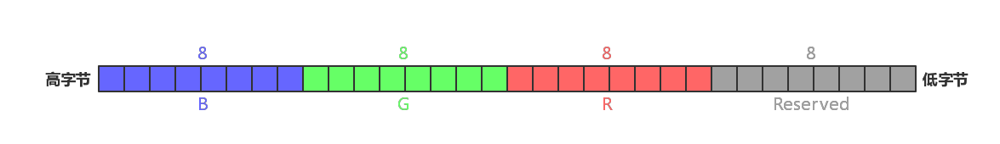
	- **获取具体像素值方法：**（假设 `color` 为存储某一个像素点的变量）

		- `R = color & 0x0000FF00`
		- `G = color & 0x00FF0000`
		- `B = color & 0xFF000000`


## 转换
### 转换矩阵
**注意：**这里的转换矩阵中，当转换为 `RGB` 读取 `YUV` 时，需要将 **U(Cb)**、**V(Cr)** 的取值范围整数表示时，转换为：`[-128, 127]`；浮点数表示时，转换为：`[-0.5, 0.5]`。

（这是因为：**U(Cb)**、**V(Cr)** 取值范围是 `[﹣128, 127]`，对应的浮点数表示为 `[﹣0.5, 0.5]`；而在存储时，为了方便存储，跟 **Y** 数据一样，统一用一个(无符号)字节表示，即取值范围是 `[0, 255]`，对应的浮点数表示为：`[0, 1]`。）

**特别注意：**在 `OpenGL` 内置的矩阵（如 `mat2`、`mat3`、`mat4` ）是 **列主序**，即需要将下列转换矩阵转换成 **转置矩阵** ！
#### YUV ——> RGB
1. **常规转换标准：**

	
2. **BT.601 标准：**（SD TV）

	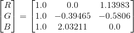
3. **BT.709 标准：**（HD TV）

	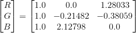

#### RGB ——> YUV
1. **常规转换标准：**

	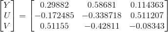
2. **BT.601 标准：**（SD TV）

	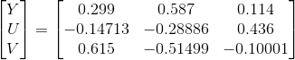
3. **BT.709 标准：**（HD TV）

	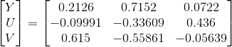
	

## 算法优化
> 举例：YUV ——> RGB 常规转换矩阵。

### 常规转换：(浮点运算）
``` c
r = y                  + (1.370705 * v);
g = y - (0.337633 * u) - (0.698001 * v);
b = y + (1.732446 * u);
```

### 优化1：避免浮点运算
> 从上述算法，可以看到存在许多的浮点运算，而在算法优化中，最好能避免浮点运算（比较耗时）来提高效率。

因此，同时对表达式中所有子项乘以 `256` 来对结果进行 **四舍五入**昨晚新的 *整数系数*，最后再对计算结果再右移 `8` 位（除以 `256`）；即，（**注意：这里的转换是有损的，精度会有所降低**）

``` c
256 * r = 256 * y                        + (256 * 1.370705 * v);
256 * g = 256 * y - (256 * 0.337633 * u) - (256 * 0.698001 * v);
256 * b = 256 * y + (256 * 1.732446 * u);
```
===》

``` c
r = ((256 * y             + (351 * v))>>8);
g = ((256 * y - (86  * u) - (179 * v))>>8);
b = ((256 * y + (444 * u))            >>8);
```

### 优化2：避免乘法运算
> 从上述算法，可以看到存在许多的乘法运算，而乘法同样也很好使，最好能避免乘法运算（使用位移运算代替）来提供效率。

因此，将所有表达式中的子项系数，拆解成整数（该整数必需是 2 的次幂，这样可以使用位移运算）相加的形式。

例如：

``` c
351 = 256 + 64 + 16 + 8 + 4 + 2 + 1 = 2^8 + 2^6 + 2^4 + 2^3 + 2^2 + 2^1 + 2^0
```

===》

``` c
r = (((y<<8) + (v<<8) + (v<<6) + (v<<4) + (v<<3) + (v<<2) + (v<<1) + v)                   >> 8);
g = (((y<<8) - (u<<6) - (u<<4) - (u<<2) - (u<<1) - (v<<7) - (v<<5) - (v<<4) - (v<<1) - v) >> 8);
b = (((y<<8) + (u<<8) + (u<<7) + (u<<5) + (u<<4) + (u<<3) + (u<<2))                       >> 8);
```

### 优化3：查表
> 在常规转换表达式中，变量的取值范围是已经确定，Y：[0, 255]，U：[-128, 127]，V：[-128, 127]；那么就可以使用一维数组存储结果来提高效率。

因此，将表达式中相关的变量计算结果分别存储在 4 个一位数组中，在使用计算时，直接通过数组查询即可获得表达式相乘结果。

例如：对于表达式 `256 * 1.370705 * v`

``` c
int rv = 0;     // 计算 R 值 V 系数

rv = 256 * 1.370705 = 351;
            
for (int i = 0; i < 256; i++)
{
    m_rv[i] = ((i - 128) * rv)>>8;
}
```

===》

``` c
r = y + m_rv[v];
g = y - m_gu[u] - m_gv[v];
b = y + m_bu[u];
```

### 算法性能比较
#### 测试说明
- 系统：macOS 10.13.5
- 环境：Xcode 9.4
- 测试文件：480 x 360，454 帧（文件大小：117,676,800 Byte）
- 转换矩阵：常规标准
- 流程描述：从源文件读取数据，对数据进行转换（`I420 ——> RGB24`），**但不写入文件**。

#### 测试结果
| 转换方式 | 循环次数 | 平均耗时（μs/次） | 平均每帧耗时（μs) |
| -------- | -------- | -------- | -------- |
| 浮点运算 | 50 | 2837788.36 | 6250.64 |
| 避免浮点运算 | 50 | 2650935.74 | 5839.07 |
| 避免乘法运算 | 50 | 3031586.02 | 6677.50 |
| 查表法 | 50 | 2674598.74 | 5891.19 |


---

## 参考
- [https://en.wikipedia.org/wiki/YUV](https://en.wikipedia.org/wiki/YUV)